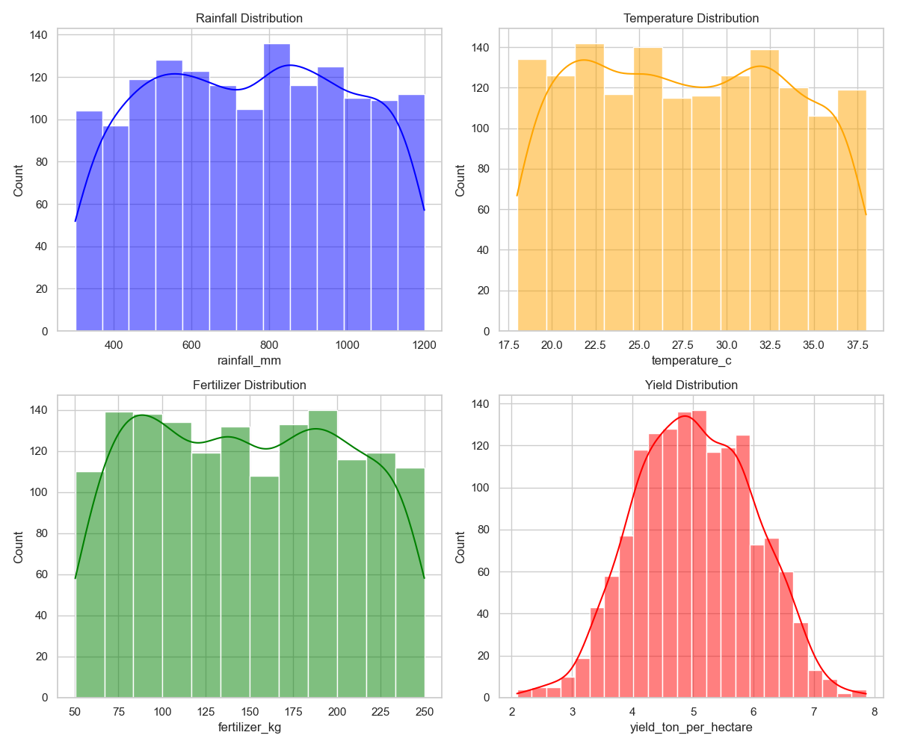
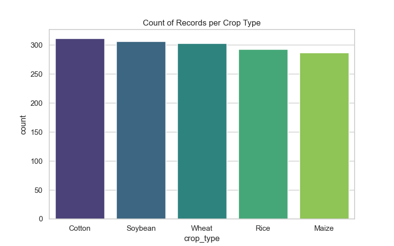
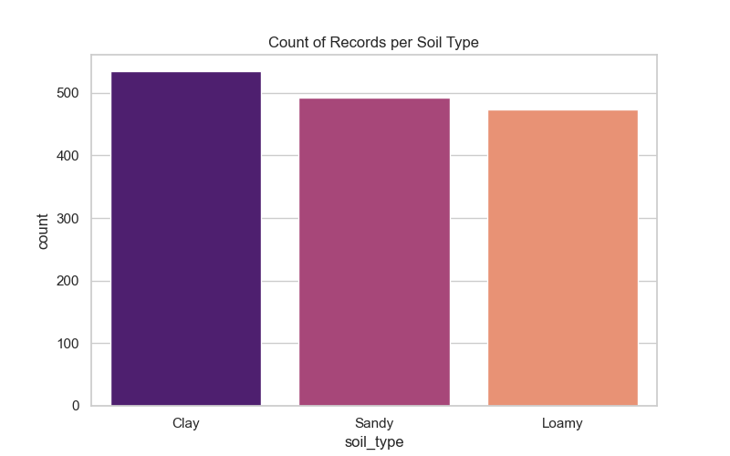
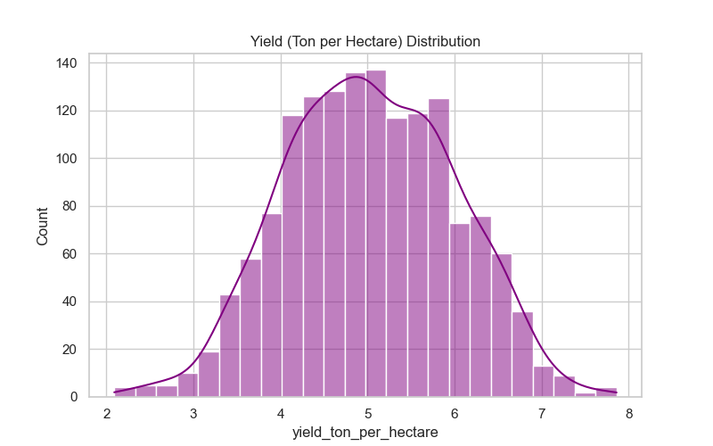
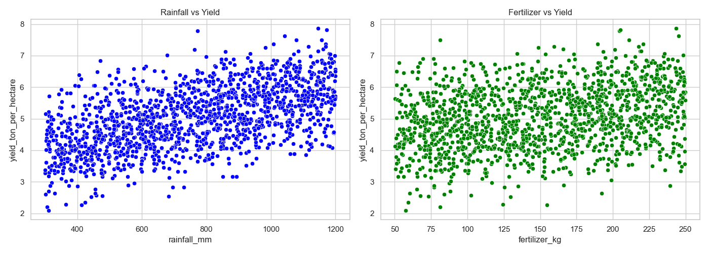
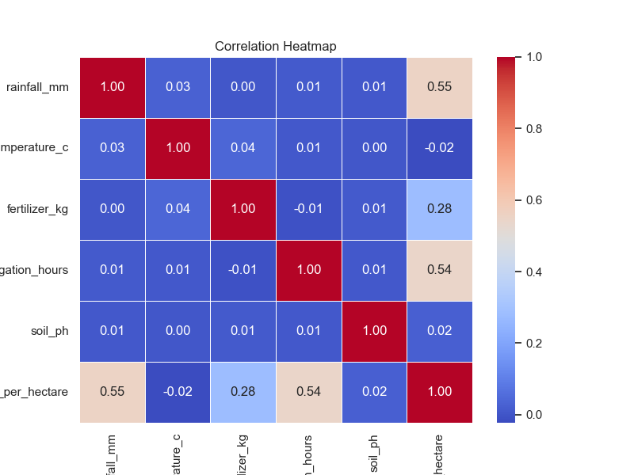

# Week-3-assignment-1kajal-
assignment_1_kajal
# 🌾 Assignment: Agriculture Yield Analytics

## 🧑‍🎓 Student Information

* **Student Name:** Kajal Rana 
* **Enrollment Number:** 02601222025
* **College Name:** Indira Gandhi Delhi Technical University For Women

---

## 📝 Project Description

This repository contains the solution for the **Agriculture Yield Analytics** assignment as part of the *6 Weeks Internship on Machine Learning and Generative AI using Python*. The project focuses on performing comprehensive Exploratory Data Analysis (EDA) and building a Linear Regression model to predict crop yields based on environmental and agricultural factors.

### 🚀 Implemented Tasks:

1. **Dataset Understanding:** Extracted summary statistics, identified data types, and verified the integrity of the dataset by checking for missing values.
2. **Exploratory Data Analysis (EDA):** Visualized the distribution of numerical features (Rainfall, Temperature, Fertilizer, Yield) and categorical features (Crop Type, Soil Type) using histograms and count plots. 
3. **Correlation & Outlier Analysis:** Analyzed relationships using scatter plots and a correlation heatmap to identify the features with the strongest impact on yield. Checked for normal distribution and outliers using skewness and Z-scores.
4. **Data Preparation:** Encoded categorical text variables into a machine-readable format using One-Hot Encoding.
5. **Linear Regression:** Split the dataset into 80% training and 20% testing data, trained a Linear Regression model, and extracted the model coefficients to understand feature importance.

---

## 📸 Output Screenshots

### Feature Distributions


### Categorical Analysis



### Yield Distribution & Outliers


### Relationship Analysis



---

## 📂 Folder Structure

```text
Assignments/Agriculture_Analytics/Ananya_Joshi_02101172025/
│
├── agriculture_eda_ml.py         # The Python script containing EDA and ML logic
├── agriculture_yield_dataset.csv # The dataset provided for analysis
├── output.txt                    # The terminal text output of the answers
├── Q4_Distributions.png          # Generated histogram grid
├── Q5_Crop_Type.png              # Generated crop frequency plot
├── Q6_Soil_Type.png              # Generated soil frequency plot
├── Q7_Yield_Distribution.png     # Generated yield skewness plot
├── Q8_Scatter_Plots.png          # Generated scatter plot comparisons
├── Q9_Correlation_Heatmap.png    # Generated correlation matrix
├── image_efdf64.png              # Assignment questions reference
└── README.md                     # Documentation and student details (This file)
```
